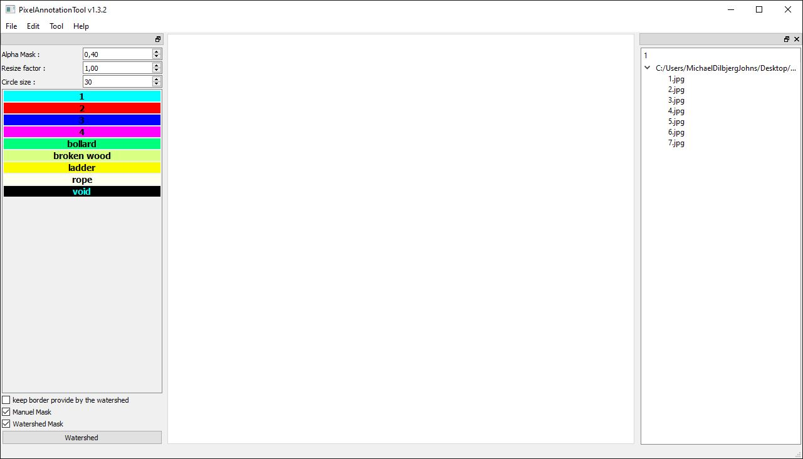
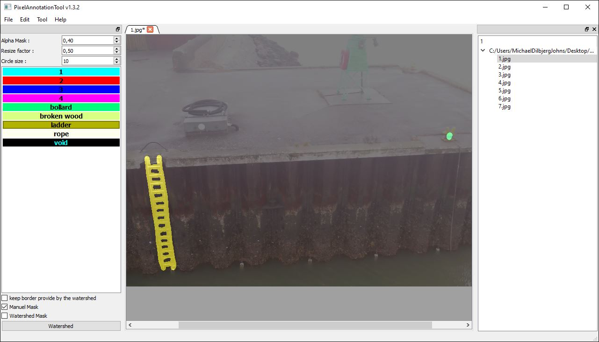
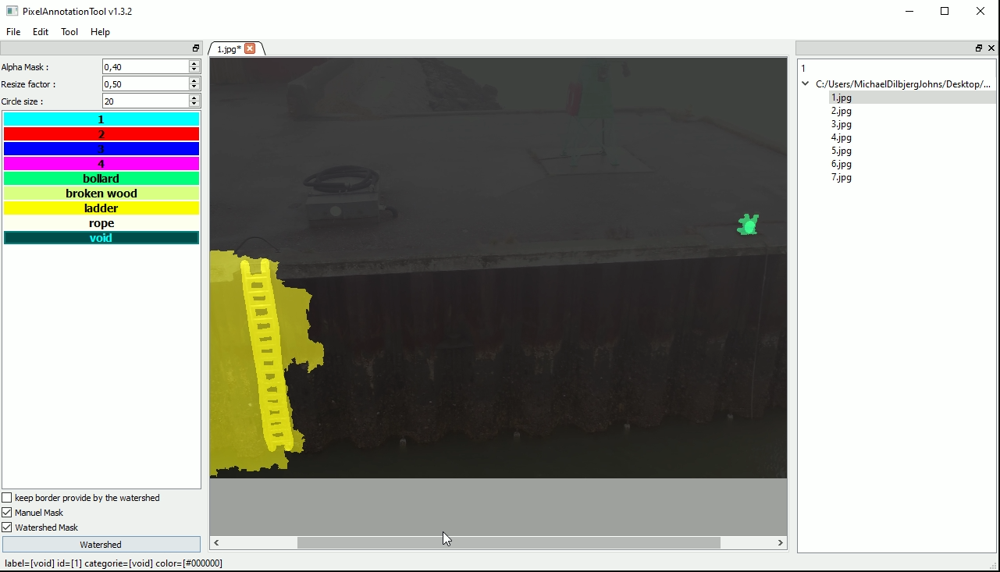
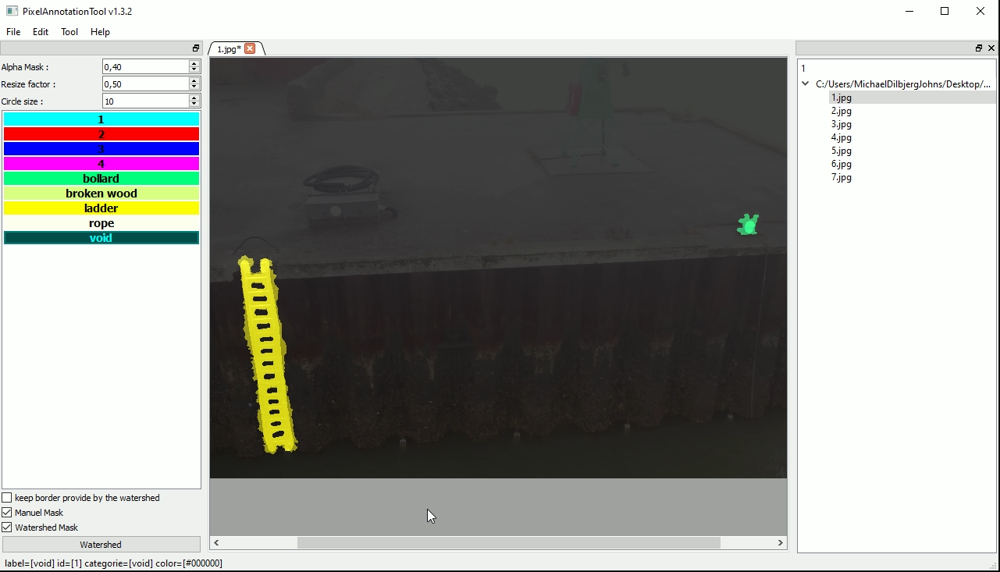

# Pixel Annotation Tool 13.2 label guide

## Download og setup

Download Pixel Annotation Tool
https://github.com/abreheret/PixelAnnotationTool/releases/tag/v1.3.2

Download [docks.json](docks.json) og læg den i Pixel Annotation Tool mappen.

Åben Pixel Annotation Tool og vælg Tool -> Open config file i menu baren. Åben docks.json.

Placer alle billeder der skal labeles i en mappe og åben denne mappe i Pixel Annotation Tool ved File -> Open directory.
Tick Watershed Mask checkboxen in nederste venstre hjørne.

## Labeling

Vælg det første billede i listen til højre.
Tegn labels på de forskellige ting i billedet der skal labeles.

Marker baggrund med "void" og tryk på Watershed knappen.

Bliv ved med at tegne void indtil maskerne passer.

Vælg File -> Save current image (eller hotkey Ctrl + S). Der skulle nu være 3 nye filer i billed mappen *_color_mask.png, *_mask.png, *_watershed_mask.png

color_mask burde se sådan ud.

Gentag indtil alle billeder er labeled.
